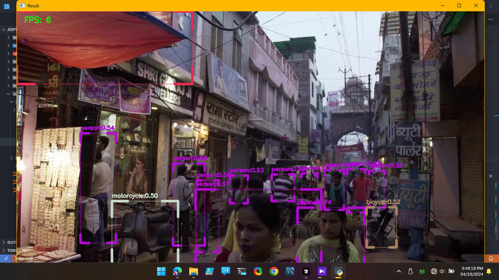

# Realtime Object Detection on CPU with OpenCV  

  


## 📌 Overview  

This project implements real-time object detection on a CPU using OpenCV. The goal is to detect objects efficiently without requiring a GPU, making it suitable for low-power devices, embedded systems, or general-purpose CPUs.  

## 🚀 Features  

- ✅ **Runs on CPU** – No dedicated GPU required.  
- ✅ **Uses OpenCV DNN module** for deep learning-based object detection.  
- ✅ **Supports multiple pre-trained models** (e.g., YOLO, SSD, MobileNet, Faster R-CNN).  
- ✅ **Efficient inference speed** optimized for real-time performance.  
- ✅ **Webcam & Video support** for live detection.  
- ✅ **Custom model integration** for personalized object detection.  

## 🛠️ Installation  

### 1️⃣ Prerequisites  
Ensure you have the following installed:  

- Python 3.x  
- OpenCV (`opencv-python` and `opencv-python-headless`)  
- NumPy  
- OpenCV DNN dependencies  

### 2️⃣ Install Dependencies  
Run the following command to install the required packages:  

```bash
pip install opencv-python opencv-python-headless numpy
```

## 🔍 Usage  

### 1️⃣ Clone the Repository  
```bash
git https://github.com/sployal/Realtime_object_detection_on_CPU_with_OpenCV
cd Realtime_object_detection_on_CPU_with_OpenCV
```

### 2️⃣ Run Object Detection on a Webcam  
```bash
python detect.py --model yolov4 --video 0
```
> Replace `0` with a video file path if using a pre-recorded video.

### 3️⃣ Run Object Detection on an Image  
```bash
python detect.py --model yolov4 --image test.jpg
```

## 📜 Supported Models  

| Model        | Speed | Accuracy | Best Use Case |
|-------------|------|----------|--------------|
| YOLOv3/v4   | ⚡ Fast  | 🔵 High | General Object Detection |
| SSD         | ⚡⚡ Faster  | 🟡 Medium | Lightweight Detection |
| MobileNet   | ⚡⚡⚡ Fastest  | 🟢 Low | Edge Devices |
| Faster R-CNN | 🛑 Slow | 🔴 Very High | High Accuracy Tasks |

## 🛠️ Custom Model Integration  
To use a custom model, follow these steps:  

1. Convert your trained model to OpenCV's `.pb`, `.onnx`, or `.caffemodel` format.  
2. Place the model in the `models/` directory.  
3. Modify `detect.py` to load the new model.  


## 📌 TODO  

- [ ] Add multi-threaded processing for speed optimization  
- [ ] Improve object tracking for better accuracy  
- [ ] Deploy on Raspberry Pi for edge computing  

## 🤝 Contributing  

Feel free to open an issue or submit a pull request if you find a bug or have an idea for improvement!  

## 📜 License  

This project is licensed under the **MIT License** – see the [LICENSE](LICENSE) file for details.  
